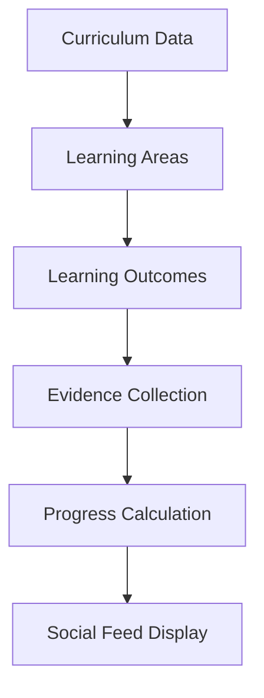
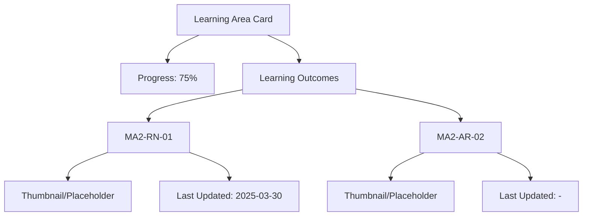

# Homeschool LMS

## Project Overview
This project is a learning management system designed for homeschooling, allowing parents to track student progress against curriculum standards.

## Design and Architecture

### Hierarchy Structure
- **Stage** (e.g., Stage 2 - Years 3-4)
  - **Learning Areas** (e.g., Mathematics)
    - **Learning Outcomes** (e.g., MA2-RN-01)

### Progress Tracking
- Learning Area Progress = (Number of Learning Outcomes with evidence / Total Learning Outcomes) * 100
- Learning Outcomes have binary state: Evidence exists or doesn't exist

### Key Components
1. Curriculum Management
2. Evidence Collection
3. Progress Tracking
4. Social Feed Display

### Workflows

### UI Layout

## Future Updates
This document will be updated as the project evolves to reflect the latest design decisions and architectural changes.
