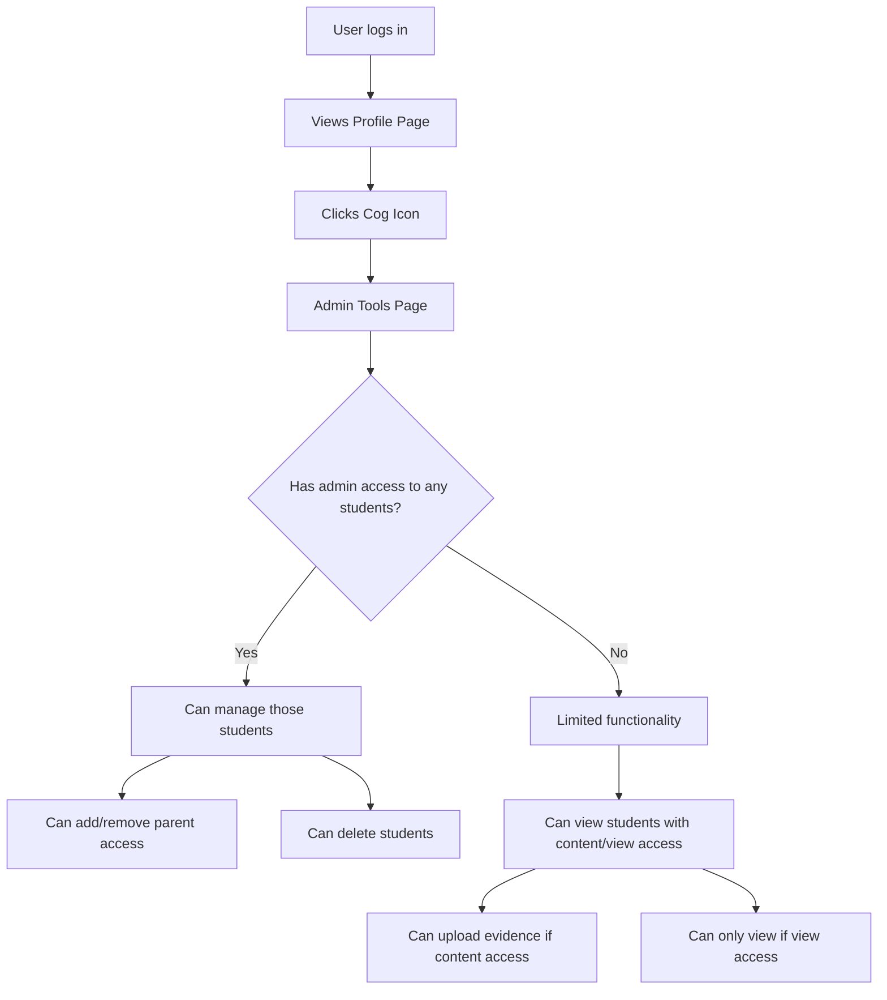

# Implementation Plan: Admin Tools Access via Profile Page

## Overview
We need to modify the system to:
1. Add a cog icon on the profile page that takes users to the admin tools page
2. Make the admin tools page accessible to all users
3. Ensure that what users can do on the admin tools page is based on their access level to specific students

## Current System Analysis
- The profile page (`ProfilePage.jsx`) currently shows an "Admin Tools" button only to users with `access_level === 10`
- The admin tools page (`AdminPage.jsx`) includes components for managing student slugs, deleting students, and managing parent access
- The parent access management system has three levels: admin, content, and view
- Parent access is managed per student, so a parent can have different access levels for different students

## Implementation Steps

### 1. Modify the Profile Page
- Update `ProfilePage.jsx` to show a cog icon (Settings icon) for all users
- Remove the conditional rendering that only shows the Admin Tools button to users with `access_level === 10`
- Style the cog icon appropriately and ensure it links to the admin tools page

### 2. Update the Admin Tools Page
- Modify `AdminPage.jsx` to handle permissions based on student-specific access levels
- Ensure that components like `DeleteStudent` and `UpdateStudentSlugs` check for admin access before allowing operations
- Update the `ManageParentAccess` component to only show students for which the current user has admin access

### 3. Update Backend Authorization Logic
- Review and potentially update the backend authorization logic to ensure it properly checks student-specific access levels
- Ensure that API endpoints for student management check for the appropriate access level

### 4. Testing
- Test all user flows with different access levels to ensure proper authorization
- Verify that users can only perform actions on students for which they have the appropriate access level

## Detailed Component Changes

### ProfilePage.jsx
```jsx
// Replace the conditional Admin Tools button with an unconditional cog icon
// Remove this conditional block:
{user && user.access_level === 10 && (
  <Button 
    as={RouterLink}
    to="/admin" 
    leftIcon={<Settings size={20} />} 
    variant="outline"
    colorScheme="gray"
    mt={6}
  >
    Admin Tools
  </Button>
)}

// Add this unconditional block:
<Button 
  as={RouterLink}
  to="/admin" 
  leftIcon={<Settings size={20} />} 
  variant="outline"
  colorScheme="gray"
  mt={6}
>
  Admin Tools
</Button>
```

### AdminPage.jsx
- No major structural changes needed, as the page already includes the necessary components
- The components themselves will handle permission checks based on the current user's access to specific students

### ManageParentAccess.jsx
- Update the `fetchStudents` function to only fetch students for which the current user has admin access
- This may require a new API endpoint or parameter to filter students by access level

```jsx
// Update the fetchStudents function to only fetch students with admin access
const fetchStudents = async () => {
  try {
    setIsLoading(true);
    // This would need a new API endpoint or parameter
    const fetchedStudents = await getStudentsWithAdminAccess();
    setStudents(fetchedStudents);
    
    // Select the first student by default if available
    if (fetchedStudents.length > 0) {
      setSelectedStudentId(fetchedStudents[0].id);
    }
  } catch (error) {
    // Error handling...
  } finally {
    setIsLoading(false);
  }
};
```

### Backend API Changes
- Update the `get_students_for_parent` endpoint to accept an optional `access_level` parameter
- Add a new endpoint or modify existing ones to filter students by the parent's access level

```python
@router.get("/students/for-parent", response_model=List[Student])
async def get_students_for_parent(
    access_level: Optional[str] = None,
    current_user: UserInDB = Depends(get_current_user)
):
    """Get all students associated with the current user (parent), optionally filtered by access level."""
    return await StudentService.get_students_for_parent(str(current_user.id), access_level)
```

## Technical Considerations
1. **Authorization Logic**: Ensure that all operations check for the appropriate access level before allowing actions
2. **API Efficiency**: Consider optimizing API calls to reduce the number of requests needed
3. **User Experience**: Make sure the UI clearly indicates what actions a user can perform based on their access level
4. **Error Handling**: Provide clear error messages when a user attempts an action they don't have permission for

## User Access Flow



## Component Interaction

```mermaid
sequenceDiagram
    actor User
    participant ProfilePage
    participant AdminPage
    participant ManageParentAccess
    participant API
    participant Database
    
    User->>ProfilePage: Views profile
    ProfilePage->>User: Shows cog icon
    User->>ProfilePage: Clicks cog icon
    ProfilePage->>AdminPage: Navigates to admin page
    AdminPage->>API: Requests students with access info
    API->>Database: Queries students with access levels
    Database->>API: Returns filtered students
    API->>AdminPage: Returns students data
    AdminPage->>ManageParentAccess: Passes student data
    ManageParentAccess->>User: Shows manageable students
    User->>ManageParentAccess: Selects student to manage
    ManageParentAccess->>API: Requests parent access for student
    API->>Database: Queries parent access
    Database->>API: Returns parent access data
    API->>ManageParentAccess: Returns parent access data
    ManageParentAccess->>User: Shows parent access options